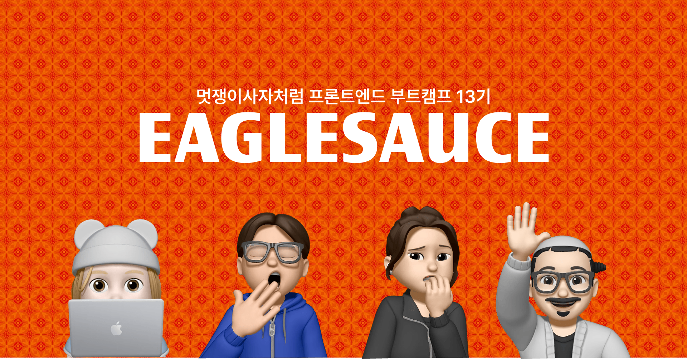
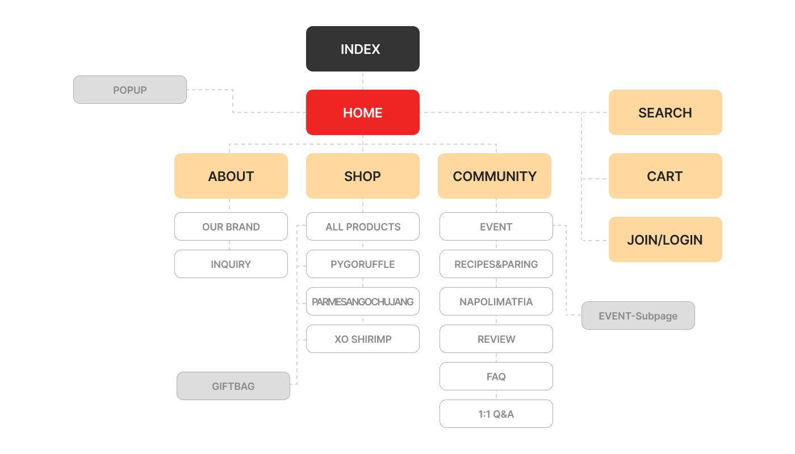
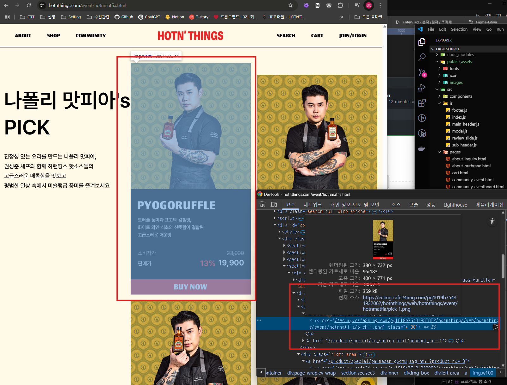
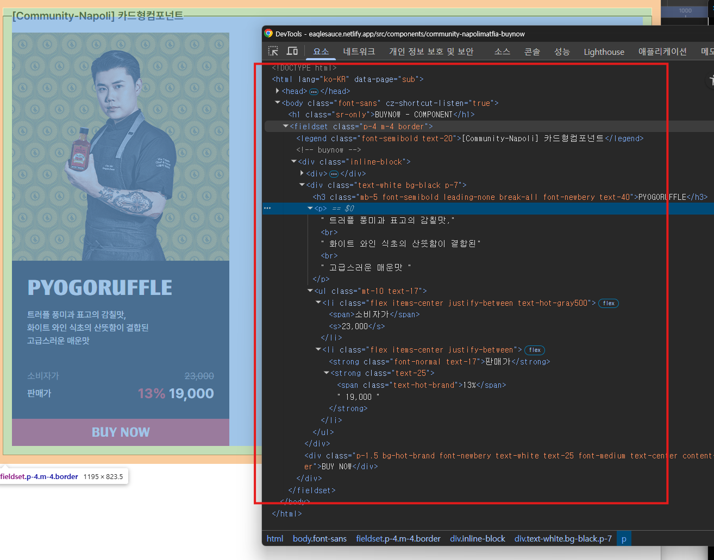
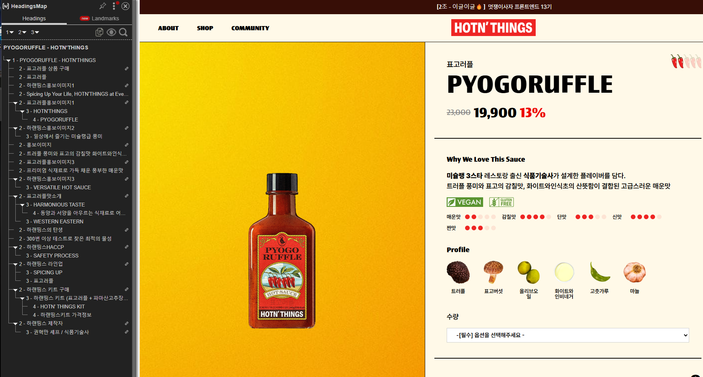
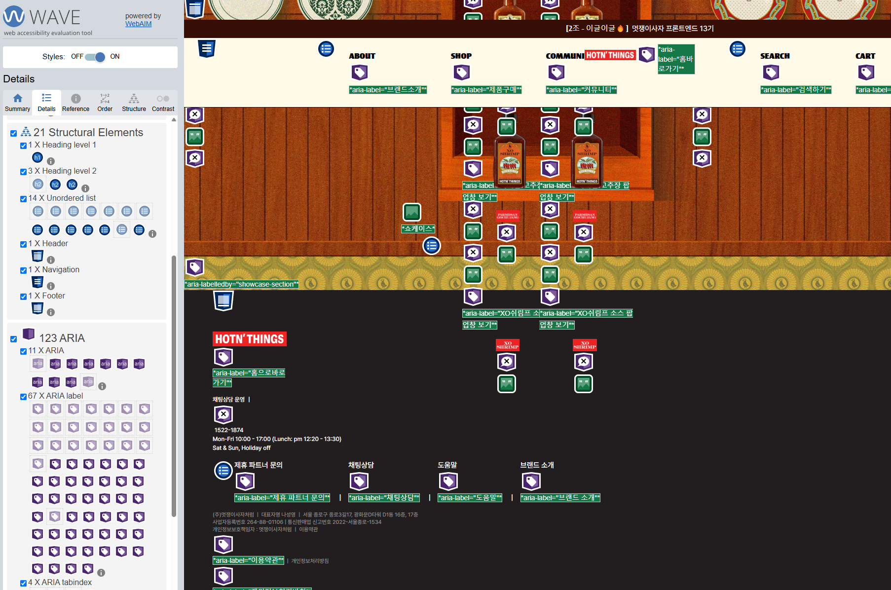
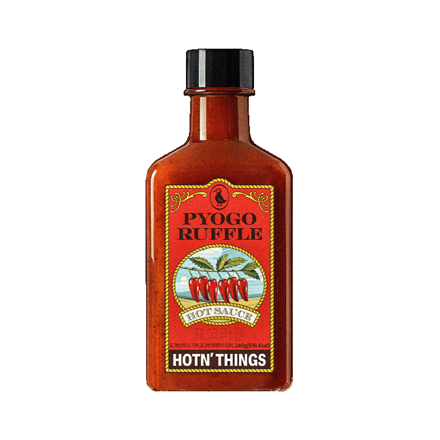

# EagleSauce
<a href="https://eaglesauce.netlify.app/" target="_blank" title="이글소스 프로젝트로 이동">

</a>

## 📝 프로젝트 개요
멋쟁이사자처럼 프론트엔드 부트캠프 13기 UI 프로젝트 2팀 이글이글입니다🔥  
저희는 핫소스를 판매하는 [하랜띵스홈페이지](https://hotnthings.com/ "하랜띵스 홈페이지로 이동")를 분석하여 사용자 경험과 웹 접근성을 개선했습니다.  
모던한 디자인과 직관적인 UX를 반영한 반응형 웹사이트를 구현하며 사용자 관점에서 컴포넌트 개발과 최적화를 진행했습니다.  
또한, 스크린 리더 지원 등을 통해 접근성을 강화하여 누구나 편리하게 이용할 수 있도록 했습니다.

- 프로젝트 진행기간 : 2025.03.14.~2025.03.25.(12일)
- 배포사이트 : [🔗이글소스홈페이지](https://eaglesauce.netlify.app/ "이글소스 프로젝트로 이동")

## 👥 프로젝트 팀 소개
<table style="text-align:center;">
  <tr>
    <td> <br/><a href="https://github.com/2sign" title="박상희 깃허브 저장소로 이동">박상희</a></td>
    <td> <br/><a href="https://github.com/kkjuno" title="김준오 깃허브 저장소로 이동">김준오</a></td>
    <td> <br/><a href="https://github.com/seonyoungg" title="박선영 깃허브 저장소로 이동">박선영</a></td>
    <td> <br/><a href="https://github.com/fipark" title="박준환 깃허브 저장소로 이동">박준환</a></td>
  </tr>
  <tr>
    <td>팀장/스크럼마스터</td>
    <td>팀원</td>
    <td>팀원</td>
    <td>팀원</td>
  </tr>
  <tr style="font-size:0.875rem; text-align:start;">
    <td>
      <ul>
        <li>All pages - Code Refactor</li>
        <li>Index</li>
        <li>Home</li>
        <li>Footer</li>
        <li>Home/Modal</li>
        <li>All Product</li>
        <li>Napoli Matfia</li>
      </ul>
    </td>
    <td>
      <ul>
        <li>All pages - Code Refactor</li>
        <li>Home/Showcase & Popup</li>
        <li>Inquiry</li>
        <li>Pyogoruffle</li>
        <li>ParmesanGochujang</li>
        <li>Giftbag</li>
        <li>Event</li>
        <li>Cart</li>
      </ul>
    </td>
    <td>
      <ul>
        <li>WebAccessbillity - Develop</li>
        <li>Index</li>
        <li>Header</li>
        <li>Our Brand</li>
        <li>Pyogoruffle</li>
        <li>Hotn'Things KIT</li>
        <li>Review</li>
        <li>Faq</li>
      </ul>
    </td>
    <td>
      <ul>
        <li>WebAccessbillity - Develop</li>
        <li>Home/Banner</li>
        <li>Pyogoruffle</li>
        <li>XO Shrimp</li>
        <li>Recipes & Paring</li>
        <li>Search</li>
        <li>Join & Login</li>
      </ul>
    </td>
  </tr>
</table>

## ⚙️ 기술스택
| 분류 | 기술 | 
|:------:|:------:|
|프론트엔드|&nbsp;&nbsp;&nbsp;|
|빌드툴|&nbsp;|
|협업툴|&nbsp;&nbsp;&nbsp;|
|디자인&개발환경|&nbsp;|

## 📂 프로젝트 구조
```
📂EagleSauce
├── 📂assets/
├── 📂public/
│   └── 📂assets/       
│         ├── 📂fonts/   
│         ├── 📂icon/   
│         └── 📂images/   
├── 📂src/
│   ├── 📂components/        
│   ├── 📂js/                         
│   └── 📂pages/               
│   📄main.js    
│   📄style.css           
├── 📄.gitignore   
├── 📄index.html   
├── 📄package-lock.json       
├── 📄package.json          
├── 📄README.md                  
└── 📄vite.config.js           
```

## 🖥️ 사이트 구조 및 주요 개선사항

### 사이트 구조


--- 

### 사이트 주요 개선사항 
#### 1. 반응형 개선  
다양한 디바이스에서 사이트가 잘 보이도록 화면 크기에 맞는 레이아웃과 스타일을 개선  
  
  

#### 2. Component화를 통한 재사용성 증대  
반복되는 UI 요소를 컴포넌트로 분리하여, 재사용 가능하고 유지보수하기 쉬운 코드 구조 작업

- 예시 : 기존사이트 이미지로 제공되던 것을 유지보수가 쉬운 컴포넌트로 분리  
<div style="display:flex; align-items:center;">


</div>

#### 3. Semantic Tag의 활용  
HTML5의 시맨틱태그를 사용하여 문서의 구조를 명확하게 하고 SEO와 접근성을 개선  
    
  

#### 4. 스크린리더 지원  
aria-label, aria-labelledby, aria-hidden와 같은 ARIA 속성을 활용하여 스크린리더 사용자 고려



#### 5. 키보드 접근성 개선  
네비게이션 메뉴에서 키보드로도 메뉴 항목을 쉽게 접근할 수 있도록 tabindex와 같은 키보드 접근성을 위한 속성을 추가
  
  


## 🔗 참고사이트
<a href="https://hotnthings.com/" title="하랜띵스 홈페이지로 이동" style="display:flex; align-items:center;">
   
  <span>하랜띵스홈페이지</span>
</a>
